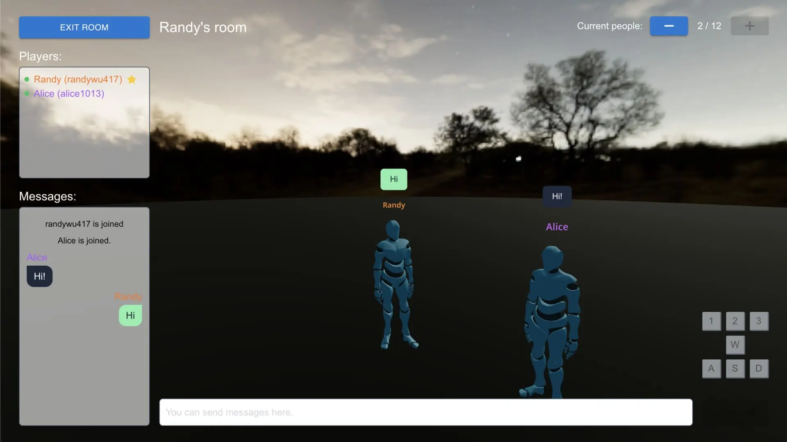
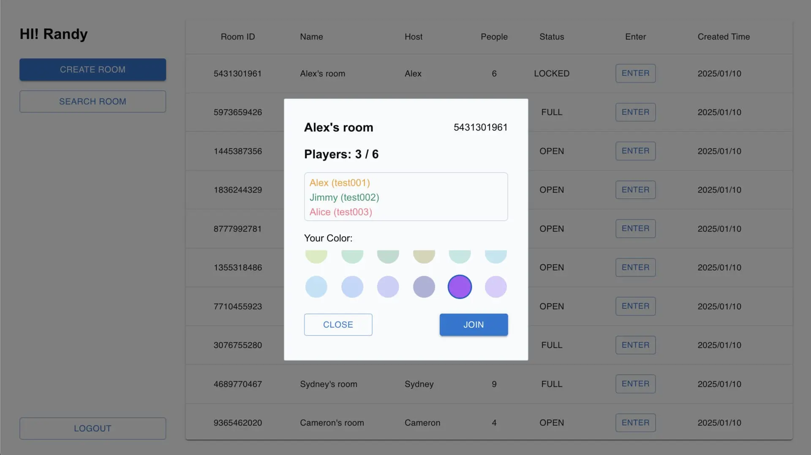
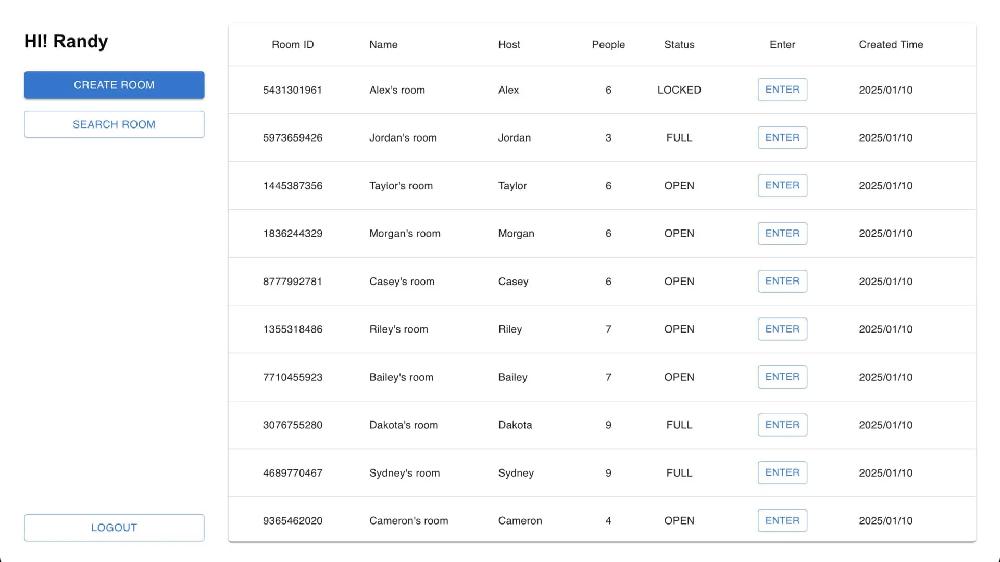
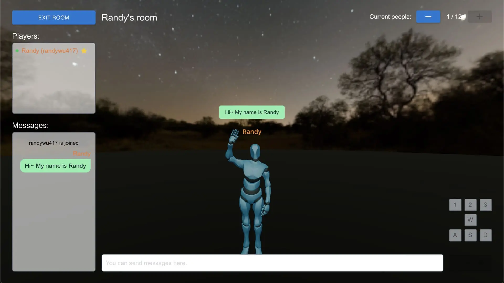
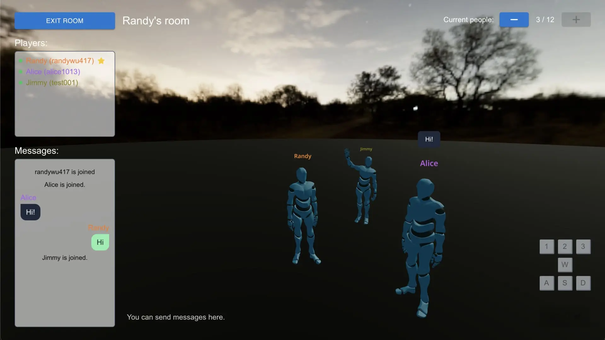

# 多人線上遊戲模擬



### [專案簡介](#intro)

### [啟動專案](#start)

### [專案畫面](#preview)

---

<h4 id="intro">專案簡介</h4>

本專案是一個多人線上遊戲的模擬練習，玩家可以創建房間並透過角色進行互動與聊天，同時角色還能執行各種動作。專案技術如下：

-   Mesh 架構：採用 Mesh Network，讓每個玩家之間建立 點對點(P2P) 的連線。

-   WebSocket：用於實現玩家之間的文字聊天以及 WebRTC 的 P2P 連線功能。

-   WebRTC Data Channels：負責傳輸角色移動的資料，確保遊戲畫面能即時渲染其他玩家的最新座標。

此專案展示了利用 WebSocket 和 WebRTC 合作，實現即時互動與資料傳輸的多人連線場景。

---

<h4 id="start">啟動專案</h4>

1. 啟動 server 端

```
cd mogs-server
npm install
npm start
```

2. 啟動 client 端

```
cd mogs-client
npm install
npm run dev
```

開啟：http://localhost:3000/

---

<h4 id="preview">專案畫面</h4>






